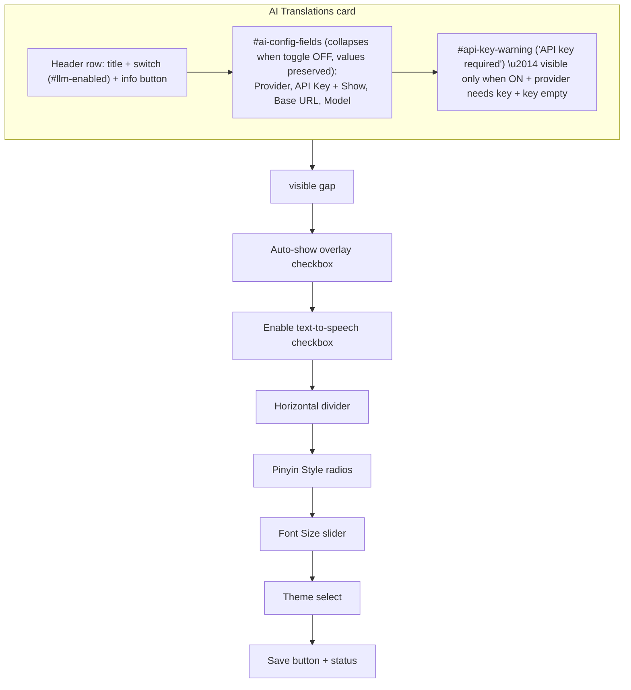

## Goal

Restructure the settings tab in `[src/popup/popup.html](src/popup/popup.html)` so the four LLM config fields live inside a collapsible "AI Translations" card whose toggle is the existing `llmEnabled` checkbox (re-styled as a switch). Lookup-behavior checkboxes follow with a visible gap, then Pinyin Style / Font Size / Theme. Storage key stays `llmEnabled` (verified used by `[src/background/service-worker.ts](src/background/service-worker.ts)`, `[src/content/content.ts](src/content/content.ts)`, `[src/reader/reader.ts](src/reader/reader.ts)`, `[src/shared/constants.ts](src/shared/constants.ts)`, `[src/shared/types.ts](src/shared/types.ts)`).

## Final layout (top to bottom inside `#tab-settings`)



## File changes

### 1. `[src/popup/popup.html](src/popup/popup.html)`

Reorder the children of `#tab-settings`. Wrap Provider / API Key / Base URL / Model in a single container, and put them inside a card whose header carries the switch and info button. Concrete shape:

```html
<div class="ai-section">
  <div class="ai-section-header">
    <label class="switch-label" for="llm-enabled">
      <input type="checkbox" id="llm-enabled" />
      <span class="switch-track"><span class="switch-thumb"></span></span>
      <span class="switch-text">AI Translations</span>
    </label>
    <button type="button" id="ai-info-btn" class="info-btn"
            aria-label="About AI Translations" aria-expanded="false">i</button>
    <div id="ai-info-popover" class="info-popover hidden" role="tooltip">
      AI translations use an LLM (e.g. Gemini, OpenAI) to provide
      context-aware translations of selected text. Requires your own API key.
    </div>
  </div>

  <div id="ai-config-fields">
    <!-- existing Provider, API Key, Base URL, Model form-groups, unchanged -->
    <p id="api-key-warning" class="inline-warning hidden">API key required</p>
  </div>
</div>

<!-- gap -->
<div class="lookup-behavior">
  <!-- existing #overlay-enabled checkbox + hint -->
  <!-- existing #tts-enabled checkbox -->
</div>

<hr class="section-divider" />

<!-- existing Pinyin Style, Font Size, Theme form-groups, unchanged -->
<!-- existing Save button + #status -->
```

The `#llm-enabled` input keeps its id so all existing TS code and tests still bind to it. The "Enable LLM-enhanced translations" caption text is replaced by "AI Translations".

### 2. `[src/popup/popup.css](src/popup/popup.css)`

Add (with dark-mode counterparts inside the existing `@media (prefers-color-scheme: dark)` block):

- `.ai-section` — bordered, rounded, padded card.
- `.ai-section-header` — flex row: switch-label grows, info button on the right.
- `.switch-label` / `.switch-track` / `.switch-thumb` — visually-hidden checkbox with a CSS-only iOS-style track/thumb that flips on `:checked`.
- `#ai-config-fields` — top-margin/padding-top so it sits below a faint `border-top` divider; `.hidden` collapses it.
- `.info-btn` — round 18px icon button.
- `.info-popover` — absolutely positioned panel under the header; small drop shadow; auto width, max ~260px.
- `.inline-warning` — small red text (uses the same red as `#status.error`).
- `.lookup-behavior` — `margin-top: 16px` to enforce the visible gap.
- `hr.section-divider` — full-width 1px separator with `margin: 16px 0`.

### 3. `[src/popup/popup.ts](src/popup/popup.ts)`

In `getElements()` add: `aiConfigFields`, `aiInfoBtn`, `aiInfoPopover`, `apiKeyWarning`.

In `initPopup()`:

- After `els.llmEnabled.checked = settings.llmEnabled;`, call a new helper `applyLlmToggleState(els)` that:
  - toggles `els.aiConfigFields.classList.toggle("hidden", !els.llmEnabled.checked)`
  - calls `updateApiKeyWarning(els)`
- Add `els.llmEnabled.addEventListener("change", () => applyLlmToggleState(els))`.
- Add `els.apiKey.addEventListener("input", () => updateApiKeyWarning(els))`.
- In the existing provider-change handler, also call `updateApiKeyWarning(els)` so switching to/from Ollama updates the warning.
- Info popover: `els.aiInfoBtn.addEventListener("click", e => { e.stopPropagation(); togglePopover(els); })`; document-level `click` handler to close when clicking outside; `keydown` for `Escape`. Update `aria-expanded` accordingly.

New helper:

```ts
function updateApiKeyWarning(els: ReturnType<typeof getElements>): void {
  const provider = els.provider.value as LLMProvider;
  const needs = PROVIDER_PRESETS[provider].requiresApiKey;
  const empty = els.apiKey.value.trim().length === 0;
  const show = els.llmEnabled.checked && needs && empty;
  els.apiKeyWarning.classList.toggle("hidden", !show);
}
```

Update `validateInputs()` so the API-key length check is **gated on `els.llmEnabled.checked`** (skip when off). Base URL check stays unconditional. `readFormValues()` is unchanged — values for hidden fields are still serialized so toggling off→on preserves them.

### 4. `[tests/popup/popup.test.ts](tests/popup/popup.test.ts)`

Update `buildPopupDOM()` to include the new wrapper (`.ai-section`, `#ai-config-fields`, `#ai-info-btn`, `#ai-info-popover`, `#api-key-warning`, `.lookup-behavior`, `hr.section-divider`). Existing element IDs are unchanged so most tests still pass.

Add a new `describe("AI Translations toggle group")` block:

- collapses `#ai-config-fields` on init when stored `llmEnabled` is `false`
- expanding the toggle reveals fields without clearing previously-loaded API key / model values
- toggling off then on preserves `apiKey`, `baseUrl`, `model`, `provider`
- `#api-key-warning` is shown when toggle is ON, provider is OpenAI, and key is empty; hidden when key is typed; hidden when provider switches to Ollama
- save with `llmEnabled = false` and an empty/short API key succeeds (no validation error) and writes `llmEnabled: false`
- the existing "validates API key when provider requires it" test stays green because default `llmEnabled` is `true`
- info popover toggles `.hidden` on `#ai-info-btn` click; closes on outside click and on `Escape`

### 5. Verification

- `npm test` — full vitest suite (popup, vocab-tab, plus untouched suites)
- `npm run build` — confirm Vite extension build still succeeds
- Manual: load the unpacked extension, verify visual layout matches the ASCII mockup, toggle on/off preserves values, info icon works, dark mode looks right.

## Out of scope

- No changes to settings storage shape or to how `service-worker.ts`/`content.ts`/`reader.ts` consume `llmEnabled`.
- No changes to the Recents tab.
- No spec-doc edits (`SPEC.md`, `IMPLEMENTATION_GUIDE.md`, `TTS_SPEC.md` reference the old "Enable LLM-enhanced translations" label) — flag only; defer unless you want them updated.