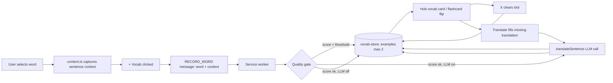

## Goal

Each `VocabEntry` gains up to **2 captured example sentences** (max), stored only when a quality gate is passed. When AI is on, the sentence translation is generated at save time and persisted long-term. The user can clear any example with an X, and can press a Translate button in the Vocab card or in Flashcards to fill in a missing translation on demand.

Sentences are only visible inside the library Vocab card (when a vocab row is opened) and on the Flashcards flip side.

## Data flow

## File-by-file changes

### 1. Data model and constants

- [src/shared/types.ts](src/shared/types.ts)
  - Add `VocabExample { sentence: string; translation?: string; capturedAt: number }`.
  - Extend `VocabEntry` with optional `examples?: VocabExample[]` (cap of 2 enforced by store).
  - Extend the `RECORD_WORD` message in `ExtensionMessage` with optional `context?: string`.
  - Add new message types: `{ type: "REMOVE_EXAMPLE"; chars: string; index: number }` and `{ type: "ADD_EXAMPLE_TRANSLATION"; chars: string; index: number; translation: string }`.
- [src/shared/constants.ts](src/shared/constants.ts)
  - Add `MAX_VOCAB_EXAMPLES = 2`.
  - Add `MIN_SENTENCE_QUALITY_SCORE = 60` (tunable threshold).
  - Add `SENTENCE_TRANSLATION_PROMPT` — a slimmed system prompt asking only for a natural English translation of the supplied sentence (no segmentation, no word data).

### 2. Quality gate (new file)

- Add [src/shared/example-quality.ts](src/shared/example-quality.ts) exporting:
  - `scoreSentence(target: string, sentence: string): number` — implements the scoring rubric we discussed: terminal punctuation, length sweet spot (8-40 chars best, 40-80 ok), Han character count > target length + buffer, contains target, penalties for URLs / pipes / pure numbers.
  - `isUsableExample(target, sentence): boolean` — true when score ≥ `MIN_SENTENCE_QUALITY_SCORE`.

### 3. LLM sentence translator

- [src/background/llm-client.ts](src/background/llm-client.ts)
  - Add `translateSentence(sentence: string, config: LLMConfig): Promise<{ ok: true; translation: string } | { ok: false; error: LLMError }>`.
  - Implementation mirrors `queryLLM`'s retry/timeout/abort scaffolding but uses `SENTENCE_TRANSLATION_PROMPT` and only requires a `{ "translation": string }` response. Reuses `buildRequest` shape with a swapped system prompt and a smaller `max_tokens` (~256). No caching needed (small surface, infrequent).

### 4. Vocab store

- [src/background/vocab-store.ts](src/background/vocab-store.ts)
  - Change `recordWords` signature to accept an optional `example?: VocabExample` per call (callers already record one word at a time on `+ Vocab` clicks).
  - On insert/update, if `example` is provided and `examples.length < MAX_VOCAB_EXAMPLES`, append it. If both slots are full, **do not auto-replace** (user must X-clear first — matches the "simplicity" decision).
  - Skip duplicates: don't append if any existing example has the same `sentence`.
  - Add `removeExample(chars: string, index: number): Promise<void>`.
  - Add `setExampleTranslation(chars: string, index: number, translation: string): Promise<void>`.
  - Update `importVocab` to merge `examples` from imports (union, deduped, capped at 2).

### 5. Service worker

- [src/background/service-worker.ts](src/background/service-worker.ts)
  - In the `RECORD_WORD` handler:
    - Read `context` from the message.
    - If `context` passes `isUsableExample`, build a `VocabExample` and pass it to `recordWords`.
    - If `settings.llmEnabled` and the API key check passes, fire `translateSentence` after the initial save; on success, call `setExampleTranslation` to attach the translation. Failures are silent (sentence kept without translation).
  - Add handlers for `REMOVE_EXAMPLE` → `removeExample` and `ADD_EXAMPLE_TRANSLATION` → wraps `translateSentence` + `setExampleTranslation`, sends the result back so the UI can refresh.

### 6. Content script context plumbing

- [src/content/overlay.ts](src/content/overlay.ts)
  - Change `setVocabCallback` signature to `cb: (word, context) => void`.
  - Add a module-level `currentContext: string` set by a new `setOverlayContext(context: string)` exported function; the `+ Vocab` click handler at [overlay.ts:404](src/content/overlay.ts) passes `currentContext` to `vocabCallback`.
- [src/content/content.ts](src/content/content.ts)
  - In `processSelection` (line 180), call `setOverlayContext(context)` right before `showOverlay`.
  - Update the `setVocabCallback` registration at [content.ts:477](src/content/content.ts) to forward `context` in the `RECORD_WORD` message.

### 7. Hub vocab card UI (library Vocab tab)

- [src/hub/hub.ts](src/hub/hub.ts)
  - In `showVocabCard` (line 110), after the existing `meta` block insert an "Examples" section that renders `entry.examples` (if any).
  - Each rendered example shows:
    - Sentence (with the target word visually emphasized via a `<mark>`-style span on string match)
    - Translation if present, or a "Translate" button if missing (disabled with tooltip when LLM is not configured)
    - Small X button that calls `chrome.runtime.sendMessage({ type: "REMOVE_EXAMPLE", chars, index })`, then re-renders the card and the vocab list.
  - The Translate button sends `ADD_EXAMPLE_TRANSLATION` and on response updates the in-memory entry and re-renders.

### 8. Flashcards flip view

- [src/hub/hub.ts](src/hub/hub.ts) — `showCard`/`flipCard` flow (lines 229-248)
- [src/library/library.html](src/library/library.html) — flashcard `fc-answer` block (lines 208-211)
  - Add a `fc-example` div inside `fc-answer`.
  - On flip, populate it with `card.examples?.[0]` (first slot only — keeps the card uncluttered).
  - If translation is missing, show a "Translate" button that triggers the same `ADD_EXAMPLE_TRANSLATION` flow and updates the visible card on response.
  - No example → render nothing (no empty placeholder).

### 9. Styling

- [src/hub/hub.css](src/hub/hub.css) (and inherited by library)
  - New rules: `.vocab-card-examples`, `.vocab-example`, `.vocab-example-sentence`, `.vocab-example-target` (highlight), `.vocab-example-translation`, `.vocab-example-x` (small icon button matching `.vocab-card-close` style at line 257), `.vocab-example-translate-btn`.
  - Mirror dark/sepia variants alongside the existing `vocab-card` overrides at lines 770, 993, 1125.
  - Add `.fc-example`, `.fc-example-translation`, `.fc-example-translate-btn` near the existing `.fc-pinyin`/`.fc-definition` styles.

### 10. Tests

- [tests/shared/example-quality.test.ts](tests/shared/example-quality.test.ts) (new)
  - Score expectations for: empty/short, target-only, fragment without punctuation, ideal mid-length sentence, URL-laden text, pure-number string, oversized passage.
  - `isUsableExample` boundary cases around `MIN_SENTENCE_QUALITY_SCORE`.
- [tests/background/vocab-store.test.ts](tests/background/vocab-store.test.ts)
  - Existing-entry append fills slot 1, then slot 2; third capture is dropped (no auto-replace).
  - Duplicate sentence is not re-added.
  - `removeExample` clears a single slot without touching other fields.
  - `setExampleTranslation` mutates only the targeted example.
  - `importVocab` round-trips `examples` and dedups on merge.
- [tests/background/llm-client.test.ts](tests/background/llm-client.test.ts)
  - Add a `translateSentence` happy-path test (mocked fetch returning `{translation: "..."}`).
  - Failure path returns a typed error (no throw).
- [tests/background/service-worker.test.ts](tests/background/service-worker.test.ts)
  - `RECORD_WORD` with low-quality context records word with no example.
  - `RECORD_WORD` with good context records word + example; if LLM is on, follow-up `setExampleTranslation` is called with the mocked translation.
- [tests/hub/hub.test.ts](tests/hub/hub.test.ts)
  - Vocab card renders 0/1/2 examples correctly.
  - Clicking the X for an example sends `REMOVE_EXAMPLE` and removes it from the DOM.
  - Translate button is disabled when the API key is empty; sends `ADD_EXAMPLE_TRANSLATION` otherwise.

## Behavior summary

- **Capture rule**: only when `scoreSentence(target, context) >= MIN_SENTENCE_QUALITY_SCORE`.
- **Slot policy**: fill empty slots; never auto-evict a saved sentence. User clears with X, then a future capture can fill the freed slot.
- **Translation policy**: auto-generated at save time when LLM enabled + sentence accepted. Persisted forever. User-clearing the sentence removes the translation with it. On-demand "Translate" button materializes a translation later if needed.
- **Visibility**: only inside the library Vocab tab's expanded card and the Flashcards flip face. The in-page overlay is unchanged.
- **Migration**: pre-existing entries simply have no `examples` field; reads tolerate `undefined`. No write needed unless the user re-saves the word.

## Open assumption (flag for confirmation)

The plan uses **score ≥ 60** as the quality threshold and **2 slots** with **no auto-replacement** when full (matches your "simplicity's sake" framing). If you want the gate stricter/looser, only the `MIN_SENTENCE_QUALITY_SCORE` constant changes. If you'd prefer a "best-of" replacement (new candidate evicts the lower-scoring existing one when both slots are full), that's a small add to `recordWords` later.