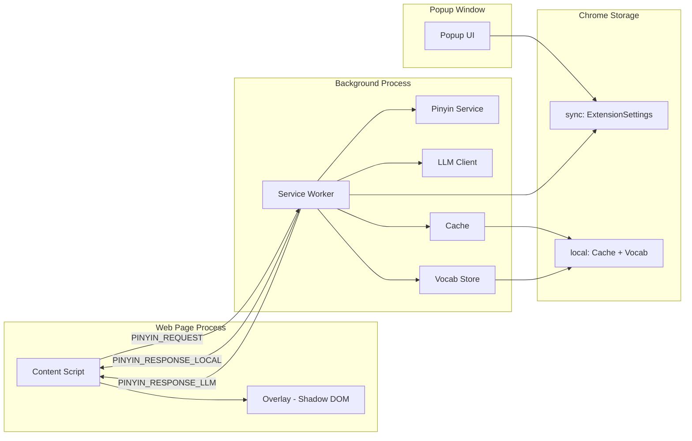

# Architecture & Design Overview

A comprehensive walkthrough of the Pinyin Tool Chrome extension: what it does,
how it is built, every major design decision, and enough tech-stack education to
let you improve it or build something similar from scratch.

---

## Table of Contents

1. [What This Extension Does](#1-what-this-extension-does)
2. [Tech Stack Primer](#2-tech-stack-primer)
3. [Project Structure](#3-project-structure)
4. [Architecture Overview](#4-architecture-overview)
5. [The Two-Phase Rendering Design](#5-the-two-phase-rendering-design)
6. [Shared Foundation -- Types & Constants](#6-shared-foundation----types--constants)
7. [Content Script Design](#7-content-script-design)
8. [Service Worker -- Orchestration Hub](#8-service-worker----orchestration-hub)
9. [LLM Client -- Adapter Pattern](#9-llm-client----adapter-pattern)
10. [Overlay & Shadow DOM](#10-overlay--shadow-dom)
11. [Popup Settings Panel](#11-popup-settings-panel)
12. [Caching & Persistence](#12-caching--persistence)
13. [Testing Strategy](#13-testing-strategy)
14. [Key Design Patterns Summary](#14-key-design-patterns-summary)

---

## 1. What This Extension Does

Pinyin Tool is a Chrome extension that lets you select Chinese text on **any
webpage** and instantly see pinyin annotations, word-level definitions, and
AI-powered translations in a floating overlay.

### User-facing capabilities

- **Instant pinyin** -- select Chinese text and see pinyin above each word
  within ~50 ms, before any network request completes
- **LLM-powered definitions & translation** -- a second pass fills in
  per-word contextual definitions and a full English translation
- **Polyphonic disambiguation** -- the LLM uses surrounding paragraph
  context to pick the correct reading (e.g. 行 as *hang* in 银行 "bank"
  vs *xing* in 行走 "to walk")
- **Vocab tracking** -- every word the LLM returns is recorded with
  frequency counts, viewable in the popup's Vocab tab
- **Theming** -- light, dark, or auto (follows OS preference)
- **Works offline** -- local-only pinyin mode requires no API key

### Three trigger methods

| Trigger | How it works |
|---|---|
| **Text selection** | Highlight Chinese text with mouse; overlay appears automatically |
| **Right-click** | Select text, then right-click > "Show Pinyin & Translation" |
| **Keyboard shortcut** | Select text, then press `Alt+Shift+P` |

---

## 2. Tech Stack Primer

Each technology was chosen for a specific reason. This section explains
*what* each tool is and *why* it was picked.

### TypeScript (strict mode)

- Catches entire categories of bugs at compile time -- misspelled message
  types, missing fields, wrong argument order
- Critical here because data crosses process boundaries (content script to
  service worker) via `chrome.runtime.sendMessage`, which is untyped by
  default; shared interfaces in `types.ts` make every message contract
  compile-checked
- `"strict": true` in `tsconfig.json` enables `strictNullChecks`,
  `noImplicitAny`, and friends

### Chrome Extension Manifest V3

- **Manifest V3** is Chrome's current extension platform (replacing V2)
- Key MV3 concept: the background script is a **service worker**, not a
  persistent background page -- it wakes on events and can be terminated at
  any time, so you cannot rely on in-memory state persisting between events
- The three execution contexts are fully isolated:

| Context | Runs in | DOM access | Chrome API access |
|---|---|---|---|
| Content script | Web page process | Full page DOM | Limited (`runtime`, `storage`) |
| Service worker | Background process | None | Full (`tabs`, `contextMenus`, etc.) |
| Popup | Extension popup window | Own DOM | Full |

- `manifest.json` declares every entry point, permission, and resource the
  browser needs to know about; Vite reads this file to determine what to
  build

### Vite + vite-plugin-web-extension

- **Vite** is a fast bundler built on Rollup with native ES module dev
  serving and TypeScript support out of the box
- **vite-plugin-web-extension** reads `manifest.json` and automatically
  resolves every entry point it declares (service worker, content scripts,
  popup HTML) into separate Rollup bundles -- no manual multi-entry config
- Why Vite over Webpack: simpler config (14 lines vs typically 50+),
  faster rebuilds via native ESM, first-class TypeScript without a separate
  loader

The entire build config:

```typescript
// vite.config.ts
import { defineConfig } from "vite";
import webExtension from "vite-plugin-web-extension";

export default defineConfig({
  plugins: [
    webExtension({
      manifest: "manifest.json",
    }),
  ],
  build: {
    outDir: "dist",
    emptyOutDir: true,
  },
});
```

### pinyin-pro

- Offline Chinese-to-pinyin library that runs entirely in the browser
- The critical API choice: `segment()` (word-level grouping) vs `pinyin()`
  (character-by-character)
- `segment()` with `OutputFormat.AllSegment` groups multi-character words
  together (e.g. "银行" as one unit) and picks contextually correct
  readings for polyphonic characters -- this is what makes Phase 1 pinyin
  reasonably accurate even without an LLM

### Shadow DOM

- A browser-native encapsulation boundary that prevents the overlay's CSS
  from leaking into the host page's styles, and vice versa
- Without it, any webpage's CSS could break the overlay layout (or the
  overlay's styles could break the page)
- Attach via `element.attachShadow({ mode: "open" })`, then all children
  and styles live inside the shadow tree

### chrome.storage (sync vs local)

| API | Max size | Syncs across devices | Use case in this extension |
|---|---|---|---|
| `chrome.storage.sync` | ~100 KB | Yes (via Google account) | User settings (`ExtensionSettings`) |
| `chrome.storage.local` | ~10 MB | No | LLM response cache + vocab store |

- Both are async key-value stores that persist across browser restarts and
  extension updates
- Both are wiped on extension uninstall

### Vitest + jsdom + vitest-chrome-mv3

- **Vitest** -- test runner compatible with Vite's config, supports
  TypeScript natively
- **jsdom** -- headless DOM implementation so tests can create elements,
  query selectors, and fire events without a real browser
- **vitest-chrome-mv3** -- provides a mock `chrome.*` global with
  stub implementations of `storage`, `runtime`, `tabs`, `contextMenus`,
  etc., plus `resetChromeMocks()` to reset state between tests

---

## 3. Project Structure

```text
Du Chinese Plugin/
|-- manifest.json              # Chrome MV3 manifest (Vite reads this)
|-- package.json               # npm scripts + dependencies
|-- tsconfig.json              # TypeScript config (strict, ES2020)
|-- vite.config.ts             # Vite build config (14 lines)
|-- vitest.config.ts           # Test runner config
|-- src/
|   |-- shared/                # Types, constants, utilities (no side effects)
|   |   |-- types.ts           # All TypeScript interfaces + message union
|   |   |-- constants.ts       # Every tunable value in one file
|   |   +-- chinese-detect.ts  # containsChinese(), extractSurroundingContext()
|   |-- background/            # Service worker process
|   |   |-- service-worker.ts  # Message router, orchestration hub
|   |   |-- llm-client.ts      # Multi-provider LLM adapter
|   |   |-- pinyin-service.ts  # pinyin-pro wrapper
|   |   |-- cache.ts           # LLM response cache (chrome.storage.local)
|   |   +-- vocab-store.ts     # Frequency-tracked word list
|   |-- content/               # Injected into every web page
|   |   |-- content.ts         # Selection detection, messaging, lifecycle
|   |   |-- overlay.ts         # Shadow DOM overlay component
|   |   +-- overlay.css        # Overlay styles (scoped via Shadow DOM)
|   +-- popup/                 # Extension toolbar popup
|       |-- popup.html         # Settings + vocab panel markup
|       |-- popup.ts           # Form logic, provider switching, vocab display
|       +-- popup.css          # Popup styles (320px fixed width)
|-- tests/                     # Mirrors src/ structure
|   |-- setup.ts               # Global mock setup (vitest-chrome-mv3)
|   |-- shared/                # chinese-detect.test.ts, constants.test.ts
|   |-- background/            # cache, llm-client, pinyin-service, service-worker, vocab-store
|   |-- content/               # content.test.ts, overlay.test.ts
|   |-- popup/                 # popup.test.ts, vocab-tab.test.ts
|   +-- integration/           # e2e-flow.test.ts, edge-cases.test.ts
+-- dist/                      # Build output (load this as "unpacked extension")
```

### The four source domains

| Domain | Responsibility | Side effects? |
|---|---|---|
| `shared/` | Type definitions, constants, detection utilities | None -- pure types and functions |
| `background/` | Service worker, LLM calls, caching, vocab | Chrome APIs, network |
| `content/` | User interaction, overlay rendering | DOM manipulation |
| `popup/` | Settings UI, vocab list | DOM, Chrome storage |

### How manifest.json drives the build

The `vite-plugin-web-extension` plugin reads `manifest.json` and resolves
each declared entry point:

```json
"background": { "service_worker": "src/background/service-worker.ts" },
"content_scripts": [{ "js": ["src/content/content.ts"] }],
"action": { "default_popup": "src/popup/popup.html" }
```

Vite produces a separate bundle for each one in `dist/`, handling tree-shaking
and code splitting automatically. You never write a manual entry map.

---

## 4. Architecture Overview

### Three isolated processes



### Unidirectional data flow

The core architectural principle: data flows in one direction from user
action through to persistent storage:

1. **User** selects Chinese text on a web page
2. **Content script** captures the selection and sends `PINYIN_REQUEST`
3. **Service worker** runs pinyin-pro (Phase 1) and LLM (Phase 2)
4. **Storage** receives cache entries and vocab records
5. **Content script** receives responses and updates the overlay

No component ever reaches back "upstream" -- the content script never
writes to storage, and the service worker never manipulates the page DOM.

### Two storage areas

| Storage | Key(s) | Contents |
|---|---|---|
| `chrome.storage.sync` | All `ExtensionSettings` fields | Provider, API key, model, pinyin style, font size, theme, LLM toggle |
| `chrome.storage.local` | SHA-256 hex hashes (cache), `"vocabStore"` | LLM response cache entries, vocab frequency records |

---

## 5. The Two-Phase Rendering Design

This is the core architectural pattern of the extension: show something
useful instantly, then enhance it asynchronously.

### Phase 1 -- Fast path (< 50 ms)

1. User selects text on a page
2. Content script sends `PINYIN_REQUEST` to the service worker
3. Service worker runs `convertToPinyin()` via the local `pinyin-pro` library
4. Service worker returns `PINYIN_RESPONSE_LOCAL` via `sendResponse()`
5. Content script shows the overlay with pinyin annotations + a "Loading
   translation..." indicator

### Phase 2 -- LLM path (1-3 seconds)

1. Service worker checks the cache for a previous LLM response
2. On cache miss, calls `queryLLM()` with text + surrounding context
3. On success, saves result to cache and records words to vocab store
4. Sends `PINYIN_RESPONSE_LLM` to the content script via
   `chrome.tabs.sendMessage()`
5. Content script replaces the Phase 1 content with disambiguated pinyin,
   definitions, and a translation

### Why this split matters

- **Perceived performance** -- the user sees useful content in < 50 ms
  instead of staring at a blank overlay for 1-3 seconds
- **Graceful degradation** -- if LLM is disabled, fails, or has no API
  key, Phase 1 pinyin still works perfectly
- **Offline support** -- with `llmEnabled: false`, the extension works
  without any network connection

### The split in code

The service worker's `handlePinyinRequest()` does the fork -- it calls
`sendResponse()` synchronously for Phase 1, then fires off the LLM path
without awaiting it:

```typescript
// service-worker.ts (lines 75-87)
async function handlePinyinRequest(
  request: PinyinRequest,
  tabId: number | undefined,
  sendResponse: (response: PinyinResponseLocal) => void,
): Promise<void> {
  const settings = await getSettings();
  const words = convertToPinyin(request.text, settings.pinyinStyle);

  sendResponse({ type: "PINYIN_RESPONSE_LOCAL", words });  // Phase 1 -- instant

  handleLLMPath(request, tabId, settings);                 // Phase 2 -- async, no await
}
```

### Request-ID staleness guard

If the user selects new text before Phase 2 completes, the old response
must be discarded. The content script uses a monotonic counter:

```typescript
// content.ts (lines 73-103)
function processSelection(text: string, rect: DOMRect, context: string): void {
  if (!containsChinese(text)) return;

  const requestId = ++currentRequestId;     // increment on every new selection

  chrome.runtime.sendMessage(
    { type: "PINYIN_REQUEST", text: truncated, context, selectionRect: { ... } },
    (response: PinyinResponseLocal) => {
      if (requestId !== currentRequestId) return;  // stale -- discard
      showOverlay(response.words, rect, cachedTheme);
    },
  );
}
```

Each new selection increments `currentRequestId`. When a response arrives,
it checks if the ID still matches -- if not, the user has moved on and the
response is silently dropped.

---

## 6. Shared Foundation -- Types & Constants

### Centralized type system (`shared/types.ts`)

Every component imports from a single file. The key types:

- **`WordData`** -- the core data atom flowing through the entire pipeline:

```typescript
interface WordData {
  chars: string;        // "银行"
  pinyin: string;       // "yín háng"
  definition?: string;  // "bank" (filled by Phase 2 only)
}
```

- **`ExtensionMessage`** -- a discriminated union of every message that
  can travel between content script and service worker:

```typescript
type ExtensionMessage =
  | PinyinRequest
  | PinyinResponseLocal
  | PinyinResponseLLM
  | PinyinError
  | { type: "CONTEXT_MENU_TRIGGER"; text: string }
  | { type: "COMMAND_TRIGGER" };
```

The `type` field acts as the discriminant, enabling `switch(message.type)`
with full type narrowing -- TypeScript knows which fields exist on each
branch.

- **`ExtensionSettings`** -- the shape of user preferences persisted in
  `chrome.storage.sync`:

```typescript
interface ExtensionSettings {
  provider: LLMProvider;
  apiKey: string;
  baseUrl: string;
  model: string;
  pinyinStyle: PinyinStyle;
  fontSize: number;
  theme: Theme;
  llmEnabled: boolean;
}
```

- **`ProviderPreset`** -- static config for each LLM backend (base URL,
  default model, API style, available models)

### Single source of truth (`shared/constants.ts`)

Design rule: **zero hard-coded values outside `constants.ts`**. Every
tunable parameter lives here:

| Constant | Value | Purpose |
|---|---|---|
| `CHINESE_REGEX` | `/[\u4e00-\u9fff\u3400-\u4dbf]/` | Detect CJK characters |
| `PROVIDER_PRESETS` | Record of 4 providers | Auto-fill popup on provider switch |
| `DEFAULT_SETTINGS` | Full `ExtensionSettings` object | Fallback for missing keys |
| `CACHE_TTL_MS` | 604,800,000 (7 days) | Cache entry lifetime |
| `MAX_CACHE_ENTRIES` | 5,000 | Cache size cap |
| `MAX_VOCAB_ENTRIES` | 10,000 | Vocab list size cap |
| `VOCAB_STOP_WORDS` | Set of 35 function words | Words excluded from tracking |
| `LLM_TIMEOUT_MS` | 10,000 (10 sec) | Abort controller timeout |
| `LLM_TEMPERATURE` | 0 | Deterministic LLM output |
| `MAX_SELECTION_LENGTH` | 500 | Truncation limit for LLM input |
| `DEBOUNCE_MS` | 100 | Mouseup debounce delay |
| `SYSTEM_PROMPT` | Multi-line string | LLM instruction for JSON output format |

To change any behavior (e.g. extend cache to 14 days, add a new LLM
provider), you edit **only this file**.

### Chinese detection utilities (`shared/chinese-detect.ts`)

Two pure functions that gate the entire extension flow:

- **`containsChinese(text)`** -- returns `true` if the string has at least
  one CJK Unified Ideograph; the content script calls this before sending
  any messages
- **`extractSurroundingContext(selection)`** -- walks up the DOM from the
  selection's anchor node to the nearest block-level parent (`<p>`, `<div>`,
  `<article>`, `<section>`, or `<body>`) and returns up to 500 characters
  of text content for LLM disambiguation

---

## 7. Content Script Design

**File:** `content/content.ts` -- injected into every page by `manifest.json`.

### Selection detection pipeline

```
mouseup -> debounce (100ms) -> getSelection() -> containsChinese()? -> processSelection()
```

- **Debouncing** prevents rapid-fire processing during click-drag
  highlighting. The `debounce()` utility delays invocation until 100 ms of
  inactivity:

```typescript
// content.ts (lines 114-128)
const handleMouseup = debounce(() => {
  const selection = window.getSelection();
  if (!selection || selection.isCollapsed) return;

  const text = selection.toString().trim();
  if (!text) return;

  const range = selection.getRangeAt(0);
  const rect = range.getBoundingClientRect();
  const context = extractSurroundingContext(selection);

  processSelection(text, rect, context);
}, DEBOUNCE_MS);

document.addEventListener("mouseup", handleMouseup);
```

- **`containsChinese()`** gate: if the selection has no Chinese characters,
  `processSelection()` returns immediately -- no messages sent, no overlay
  shown
- **Truncation**: selections longer than `MAX_SELECTION_LENGTH` (500 chars)
  are truncated before sending to the LLM, with a notice shown on the
  overlay

### Message passing

Two different Chrome messaging APIs serve the two phases:

| Phase | API | Direction | Why |
|---|---|---|---|
| Phase 1 | `chrome.runtime.sendMessage()` with callback | Content -> SW -> Content | `sendResponse()` returns data in the same message channel |
| Phase 2 | `chrome.tabs.sendMessage()` | SW -> Content | Separate message because the original channel is already closed |

The content script's `onMessage` listener handles Phase 2 responses and
trigger messages:

```typescript
// content.ts (lines 143-166)
chrome.runtime.onMessage.addListener(
  (message: ExtensionMessage) => {
    switch (message.type) {
      case "PINYIN_RESPONSE_LLM":
        updateOverlay(message.words, message.translation);
        break;
      case "PINYIN_ERROR":
        if (message.phase === "llm") showOverlayError("");
        break;
      case "CONTEXT_MENU_TRIGGER":
        handleContextMenuTrigger(message.text);
        break;
      case "COMMAND_TRIGGER":
        handleCommandTrigger();
        break;
    }
  },
);
```

### Overlay lifecycle

```
processSelection() -> showOverlay() -> [updateOverlay()] -> dismissOverlay()
```

- **Create/show**: Phase 1 response triggers `showOverlay()` with local pinyin
- **Update**: Phase 2 response triggers `updateOverlay()` with LLM data
- **Dismiss**: click outside the Shadow DOM host, press Escape, or select
  new text

### Theme caching

Instead of reading `chrome.storage.sync` on every overlay render (which
would be async and add latency), the theme is read once at init and kept
in sync reactively:

```typescript
// content.ts (lines 239-247)
chrome.storage.sync.get("theme", (result) => {
  if (result.theme) cachedTheme = result.theme as Theme;
});

chrome.storage.onChanged.addListener((changes, areaName) => {
  if (areaName === "sync" && changes.theme?.newValue) {
    cachedTheme = changes.theme.newValue as Theme;
  }
});
```

---

## 8. Service Worker -- Orchestration Hub

**File:** `background/service-worker.ts` -- the central coordinator.

### Responsibilities

- Routes incoming `PINYIN_REQUEST` messages
- Loads user settings on every request (picks up live changes)
- Dispatches Phase 1 to `pinyin-service.ts`
- Dispatches Phase 2 to `llm-client.ts` (with cache and vocab side effects)
- Registers the context menu and handles keyboard shortcuts

### Settings loading

Settings are read from `chrome.storage.sync` on every request and merged
with `DEFAULT_SETTINGS` so missing keys always have fallbacks:

```typescript
// service-worker.ts (lines 43-46)
export async function getSettings(): Promise<ExtensionSettings> {
  const stored = await chrome.storage.sync.get(null);
  return { ...DEFAULT_SETTINGS, ...stored };
}
```

This means changing a setting in the popup takes effect immediately on
the next selection -- no service worker restart needed.

### Phase 2 dispatch flow

The `handleLLMPath()` function orchestrates the entire async path:

1. **Guard**: skip if LLM is disabled or no tab ID
2. **API key check**: if provider requires a key and none is set, send
   `PINYIN_ERROR` to the content script
3. **Cache lookup**: hash `text + context` with SHA-256, check
   `chrome.storage.local`
4. **Cache hit**: send cached response, record words to vocab
5. **Cache miss**: call `queryLLM()`, save to cache, send response,
   record words
6. **Failure**: send `PINYIN_ERROR` with fallback message

```typescript
// service-worker.ts (lines 115-128)
const cacheKey = await hashText(request.text + request.context);
const cached = await getFromCache(cacheKey);

if (cached) {
  chrome.tabs.sendMessage(tabId, {
    type: "PINYIN_RESPONSE_LLM",
    words: cached.words,
    translation: cached.translation,
  });
  recordWords(cached.words);
  return;
}
```

### Context menu & keyboard shortcut

Both are registered declaratively and forwarded to the content script:

- **Context menu**: created in `chrome.runtime.onInstalled`, fires
  `CONTEXT_MENU_TRIGGER` with the selection text
- **Keyboard shortcut**: defined in `manifest.json` under `"commands"`,
  fires `COMMAND_TRIGGER` (no text -- the content script reads the
  selection directly)

---

## 9. LLM Client -- Adapter Pattern

**File:** `background/llm-client.ts` -- a multi-provider LLM client that
uses the adapter pattern to isolate provider-specific API differences.

### The adapter pattern

Two internal functions handle the provider-specific differences:

| Function | Purpose |
|---|---|
| `buildRequest()` | Constructs the provider-specific URL + `RequestInit` |
| `parseResponse()` | Extracts the LLM's text from the provider-specific response envelope |

Everything else (timeout, retry, validation) is provider-agnostic.

### Two API styles

| Style | Providers | Request format | Response path |
|---|---|---|---|
| `"openai"` | OpenAI, Ollama, custom | `POST /chat/completions` with `messages[]` | `choices[0].message.content` |
| `"gemini"` | Google Gemini | `POST /v1beta/models/{model}:generateContent` | `candidates[0].content.parts[0].text` |

The `buildRequest()` function branches on `apiStyle`:

```typescript
// llm-client.ts -- OpenAI-compatible branch (lines 98-115)
return {
  url: `${config.baseUrl}/chat/completions`,
  init: {
    method: "POST",
    headers,
    body: JSON.stringify({
      model: config.model,
      temperature: config.temperature,
      max_tokens: config.maxTokens,
      response_format: { type: "json_object" },
      messages: [
        { role: "system", content: SYSTEM_PROMPT },
        { role: "user", content: userContent },
      ],
    }),
    signal,
  },
};
```

### Adding a new provider

To add a new OpenAI-compatible provider (e.g. Groq, Together AI):

1. Add a `ProviderPreset` entry to `PROVIDER_PRESETS` in `constants.ts`
2. Add the provider name to the `LLMProvider` union in `types.ts`
3. Add an `<option>` in `popup.html`

No changes to `llm-client.ts` needed -- the adapter automatically handles
it because the new provider uses the `"openai"` API style.

### Error handling strategy

- **Timeout**: `AbortController` with `LLM_TIMEOUT_MS` (10 seconds)
- **Retry**: one retry on 5xx server errors with a 1-second delay
- **Graceful failure**: `queryLLM()` returns `null` on any error; the
  caller falls back to Phase 1 local pinyin

```typescript
// llm-client.ts (lines 158-180)
export async function queryLLM(
  text: string, context: string, config: LLMConfig,
): Promise<LLMResponse | null> {
  const controller = new AbortController();
  const timeout = setTimeout(() => controller.abort(), LLM_TIMEOUT_MS);

  try {
    const result = await attemptFetch(text, context, config, apiStyle, controller.signal);
    if (result) return result;
    return null;
  } catch {
    return null;     // any error -> graceful null, Phase 1 still visible
  } finally {
    clearTimeout(timeout);
  }
}
```

### Response validation

A type guard validates the shape of parsed LLM JSON before it enters the
pipeline:

```typescript
// llm-client.ts (lines 40-46)
export function validateLLMResponse(data: unknown): data is LLMResponse {
  if (!data || typeof data !== "object") return false;
  const obj = data as Record<string, unknown>;
  if (!Array.isArray(obj.words)) return false;
  if (typeof obj.translation !== "string") return false;
  return true;
}
```

If the LLM returns malformed JSON, `validateLLMResponse()` returns `false`,
`attemptFetch()` returns `null`, and the user keeps their Phase 1 pinyin.

---

## 10. Overlay & Shadow DOM

**File:** `content/overlay.ts` -- a DOM-only module with no Chrome API
dependencies, making it fully testable with jsdom.

### Why Shadow DOM

The overlay renders on top of arbitrary web pages. Without encapsulation:
- The page's CSS could break the overlay (e.g. a global `* { margin: 0 }`)
- The overlay's CSS could break the page

Shadow DOM solves both problems. The overlay creates a shadow root on a
host `<div>` and all rendering + styles live inside:

```typescript
// overlay.ts (lines 34-53)
export function createOverlay(): ShadowRoot {
  const existing = document.getElementById("hg-extension-root");
  if (existing?.shadowRoot) {
    hostElement = existing;
    shadowRoot = existing.shadowRoot;
    return shadowRoot;
  }

  hostElement = document.createElement("div");
  hostElement.id = "hg-extension-root";
  document.body.appendChild(hostElement);

  shadowRoot = hostElement.attachShadow({ mode: "open" });

  const style = document.createElement("style");
  style.textContent = overlayStyles;   // injected via Vite's ?inline CSS import
  shadowRoot.appendChild(style);

  return shadowRoot;
}
```

### CSS injection via `?inline`

Vite's `?inline` suffix imports a CSS file as a string instead of injecting
it into the page:

```typescript
import overlayStyles from "./overlay.css?inline";
```

This string is then set as `<style>` content inside the shadow root. The
CSS never touches the host page.

The `vite-env.d.ts` file declares the TypeScript module type:

```typescript
declare module "*.css?inline" {
  const css: string;
  export default css;
}
```

### CSS architecture

- **`:host { all: initial }`** -- resets every inherited property inside
  the shadow root so no host page styles leak in
- **Theme classes** -- `.hg-light` and `.hg-dark` on the overlay container
  control colors; `resolveTheme("auto")` uses `window.matchMedia` to pick
  one at render time
- **`z-index: 2147483647`** -- maximum 32-bit integer ensures the overlay
  sits above everything
- **Entrance animation** -- `@keyframes hg-fade-in` provides a 150 ms
  fade + slight slide-up

### Ruby annotations

Chinese text with pinyin is rendered using HTML `<ruby>` / `<rt>` elements,
the browser-native mechanism for annotation text above base text:

```typescript
// overlay.ts (lines 183-194)
export function renderRubyText(words: WordData[]): string {
  return words
    .map((w) => {
      const defAttr = w.definition
        ? ` data-definition="${escapeAttr(w.definition)}"`
        : "";
      return `<ruby class="hg-word" data-chars="${escapeAttr(w.chars)}"${defAttr}>`
        + `${escapeHtml(w.chars)}<rt>${escapeHtml(w.pinyin)}</rt></ruby>`;
    })
    .join("");
}
```

Each `<ruby>` element carries `data-chars` and `data-definition` attributes
used by the click-to-define handler.

### Overlay positioning

`calculatePosition()` is a pure function that places the overlay near the
selection:

- **Below** the selection with an 8 px gap (preferred)
- **Above** the selection if there isn't enough viewport space below
- **Clamped horizontally** to stay within the viewport

```typescript
// overlay.ts (lines 202-221)
export function calculatePosition(
  rect: DOMRect, overlayWidth: number, overlayHeight: number,
): { top: number; left: number } {
  const gap = 8;
  const spaceBelow = window.innerHeight - rect.bottom;
  const top = spaceBelow >= overlayHeight + gap
    ? rect.bottom + gap
    : rect.top - overlayHeight - gap;

  const idealLeft = rect.left + rect.width / 2 - overlayWidth / 2;
  const left = Math.max(0, Math.min(idealLeft, window.innerWidth - overlayWidth));

  return { top, left };
}
```

### Click-to-define

After Phase 2, each word in the overlay has a `data-definition` attribute.
Clicking a word toggles a definition card:

- If a card for that word is already visible, remove it
- If a card for a different word is visible, replace it
- Otherwise, create a new card below the pinyin row

---

## 11. Popup Settings Panel

**Files:** `popup/popup.html`, `popup/popup.ts`, `popup/popup.css`

### Two-tab layout

| Tab | Contents |
|---|---|
| **Settings** | Provider, API key, base URL, model, pinyin style, font size, theme, LLM toggle, save button |
| **Vocab** | Sortable word list (frequency / recency), clear button |

### Provider switching

When the user picks a new provider, `onProviderChange()` auto-fills
everything from `PROVIDER_PRESETS` and, for Ollama, dynamically fetches
the installed model list:

```typescript
// popup.ts
async function onProviderChange(els: ReturnType<typeof getElements>): Promise<void> {
  const provider = els.provider.value as LLMProvider;
  const preset = PROVIDER_PRESETS[provider];

  els.baseUrl.value = preset.baseUrl;
  els.baseUrl.placeholder = preset.baseUrl || "https://...";

  if (preset.requiresApiKey) {
    els.apiKeyGroup.classList.remove("hidden");
  } else {
    els.apiKeyGroup.classList.add("hidden");
  }

  await refreshModels(els, provider, preset.defaultModel);
}
```

- Base URL auto-fills from the preset
- API key field shows/hides based on `requiresApiKey`
- Model dropdown: for **Ollama**, models are fetched live from the
  `/v1/models` endpoint (with a "Loading models..." transient state);
  if Ollama is unreachable, the dropdown falls back to the hardcoded
  preset list and a warning is shown. For other providers, the static
  `PROVIDER_PRESETS` list is used.
- A refresh button (visible only for Ollama) lets the user re-fetch
  models on demand
- A "Custom..." sentinel option reveals a free-text input for arbitrary
  model names

### Input validation

Before saving, `validateInputs()` checks:
- API key is at least 10 characters (for providers that require one)
- Base URL starts with `http://` or `https://`

### Settings persistence

On save, `readFormValues()` collects all form inputs into an
`ExtensionSettings` object and writes it to `chrome.storage.sync`. The
service worker's `getSettings()` reads these on every request, so changes
take effect immediately.

### Vocab tab

- `getAllVocab()` reads the entire vocab store from `chrome.storage.local`
- Two sort modes: **frequency** (most encountered first) or **recency**
  (most recently seen first)
- Each row shows: characters, pinyin, definition, encounter count
- "Clear" button calls `clearVocab()` after a confirmation dialog

### Testability

`initPopup()` is exported so tests can call it directly after setting up
a DOM with the expected element IDs, without needing a real
`DOMContentLoaded` event.

---

## 12. Caching & Persistence

### LLM response cache (`background/cache.ts`)

**Purpose:** avoid redundant LLM API calls when the user re-selects the
same text.

#### Cache key generation

```
hashText(selectedText + surroundingContext)  ->  SHA-256 hex string
```

The key includes surrounding context so the same word in different
paragraphs gets separate entries with contextually correct definitions.
This matters for polyphonic characters like 行 that change pronunciation
based on context.

```typescript
// cache.ts (lines 35-42)
export async function hashText(text: string): Promise<string> {
  const encoded = new TextEncoder().encode(text);
  const digest = await crypto.subtle.digest("SHA-256", encoded);
  const bytes = new Uint8Array(digest);
  return Array.from(bytes)
    .map((b) => b.toString(16).padStart(2, "0"))
    .join("");
}
```

Uses the Web Crypto API (`crypto.subtle`), which is available in service
workers without any polyfill.

#### Expiration strategy

Two mechanisms:

- **Lazy expiration on read** -- `getFromCache()` checks the entry's
  timestamp; if it's older than `CACHE_TTL_MS` (7 days), deletes it and
  returns `null`
- **Bulk eviction on install/update** -- `evictExpiredEntries()` runs in
  `chrome.runtime.onInstalled`, doing two passes:
  1. Remove all entries older than 7 days
  2. If remaining count exceeds `MAX_CACHE_ENTRIES` (5,000), drop the
     oldest until under the limit

#### Cache entry shape

```typescript
interface CacheEntry {
  data: LLMResponse;    // { words: WordData[], translation: string }
  timestamp: number;     // Date.now() at write time
}
```

### Vocabulary store (`background/vocab-store.ts`)

**Purpose:** build a long-term frequency profile of every Chinese word the
user encounters.

#### Storage layout

All entries live under a single key: `"vocabStore"` in
`chrome.storage.local`. The value is a `Record<string, VocabEntry>` keyed
by the word's characters.

#### Recording words

`recordWords()` is called after every LLM response (both cache hits and
fresh API calls):

1. **Stop-word filter** -- skips 35 common function words (的, 了, 是, etc.)
   that would flood the list
2. **Existing word** -- increments `count`, updates `lastSeen`, refreshes
   `pinyin` and `definition`
3. **New word** -- creates entry with `count: 1`
4. **Eviction** -- if total exceeds `MAX_VOCAB_ENTRIES` (10,000), drops
   least-frequent entries

```typescript
// vocab-store.ts (lines 33-51)
for (const word of words) {
  if (VOCAB_STOP_WORDS.has(word.chars)) continue;
  const existing = store[word.chars];
  if (existing) {
    existing.count += 1;
    existing.lastSeen = now;
    existing.pinyin = word.pinyin;
    existing.definition = word.definition;
  } else {
    store[word.chars] = {
      chars: word.chars,
      pinyin: word.pinyin,
      definition: word.definition,
      count: 1,
      firstSeen: now,
      lastSeen: now,
    };
  }
}
```

---

## 13. Testing Strategy

### Test setup

**File:** `tests/setup.ts` -- runs before every test file.

```typescript
import { chrome, resetChromeMocks } from "vitest-chrome-mv3";

Object.assign(globalThis, { chrome });

beforeEach(() => {
  resetChromeMocks();
});
```

- `vitest-chrome-mv3` provides a mock `chrome` object with stub
  implementations of `storage.sync`, `storage.local`, `runtime`,
  `tabs`, `contextMenus`, etc.
- `resetChromeMocks()` in `beforeEach` ensures each test gets a clean
  slate -- no storage leaking between tests

### Test configuration

```typescript
// vitest.config.ts
export default defineConfig({
  test: {
    globals: true,            // describe/it/expect without imports
    environment: "jsdom",     // DOM emulation for overlay + popup tests
    setupFiles: ["./tests/setup.ts"],
    include: ["tests/**/*.test.ts"],
    css: true,                // process CSS imports in tests
  },
});
```

### Mirror structure

The `tests/` directory mirrors `src/` exactly:

| Source | Test |
|---|---|
| `src/shared/chinese-detect.ts` | `tests/shared/chinese-detect.test.ts` |
| `src/background/cache.ts` | `tests/background/cache.test.ts` |
| `src/background/llm-client.ts` | `tests/background/llm-client.test.ts` |
| `src/content/content.ts` | `tests/content/content.test.ts` |
| `src/content/overlay.ts` | `tests/content/overlay.test.ts` |
| `src/popup/popup.ts` | `tests/popup/popup.test.ts` |

Plus integration tests in `tests/integration/`:
- `e2e-flow.test.ts` -- full selection-to-overlay flow
- `edge-cases.test.ts` -- boundary conditions

### What makes extension testing unique

- **No real browser** -- `jsdom` provides enough DOM API for overlay
  rendering and popup form testing
- **Mock message passing** -- `vitest-chrome-mv3` stubs
  `chrome.runtime.sendMessage`, `chrome.tabs.sendMessage`, and the
  `onMessage` listener registration so you can simulate the full
  content-script-to-service-worker round trip
- **Mock storage** -- `chrome.storage.sync.get/set` and
  `chrome.storage.local.get/set` work as in-memory stores within each test

---

## 14. Key Design Patterns Summary

| Pattern | Where used | Why |
|---|---|---|
| **Two-phase rendering** | Service worker + content script + overlay | Show useful content instantly, enhance asynchronously |
| **Adapter pattern** | `llm-client.ts` (`buildRequest` / `parseResponse`) | Isolate provider-specific API formats; add providers without code changes |
| **Discriminated union** | `ExtensionMessage` type in `types.ts` | Type-safe message protocol with exhaustive `switch` checking |
| **Shadow DOM isolation** | `overlay.ts` | Prevent CSS conflicts between overlay and any host page |
| **Centralized configuration** | `constants.ts` | Single file to tune every behavior; no scattered magic numbers |
| **Request-ID staleness guard** | `currentRequestId` in `content.ts` | Discard responses from superseded selections |
| **Lazy + bulk eviction** | `cache.ts` | Expire on read (no scan overhead) + full cleanup on install/update |
| **Stop-word filtering** | `vocab-store.ts` via `VOCAB_STOP_WORDS` | Keep vocab list meaningful by excluding ultra-common function words |
| **Settings merge with defaults** | `getSettings()` / `loadSettings()` | Missing keys always have sensible fallbacks; forward-compatible with new settings |
| **Optimistic UI** | Phase 1 overlay with "Loading..." indicator | User sees content immediately while waiting for the slow path |
